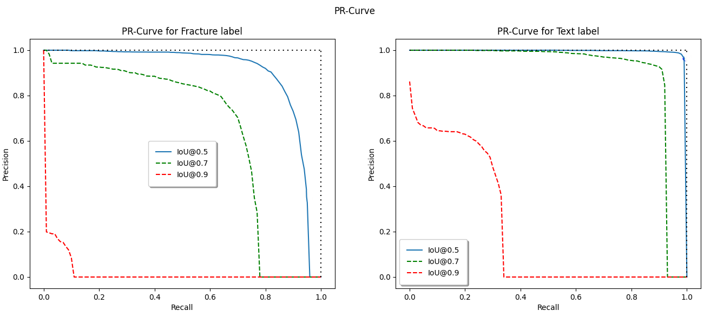

Master_Thesis
==============================

This is a master thesis repository for my masters in Human Center AI in DTU.

Abstract
==============================

Fracture detection plays a crucial role in medical diagnostics, and deep learning models have shown promise in improving accuracy and efficiency in this domain. This thesis investigates the application of different deep learning architectures, namely Faster RCNN and Detection Transformer, for fracture detection, with a focus on pediatric wrist X-rays. 

The Faster RCNN model is renowned for its exceptional performance in object detection tasks, including fracture detection. On the other hand, the Detection Transformer model introduces the concept of "Context-Awareness" through its attention mechanism, forming a hypothesis that this type of model is more suitable for problems like Fracture detection. "Context-Awareness" refers to the process of detecting and identifying objects in an image by considering the surrounding context and incorporating it into the detection algorithm to improve accuracy and understanding of the scene. Also, the value of study-wise prediction in a multiview approach to the problem is also investigated with the same models. The primary objective is to compare these two architectures and approaches, aiming to identify the most accurate and effective suggestion model to assist doctors and healthcare practitioners. The experimental and evaluation processes are designed accordingly.  

Surprisingly, the initial assumption that the Detection Transformer model might outperform the Faster RCNN model is proven incorrect. The experimental results consistently demonstrate that the Faster RCNN model maintains its reputation as a robust detector, outperforming the Detection Transformer model in both single-view and multiview approaches. The Faster RCNN model achieves an impressive AP@50 value of 89.9\%, further reinforcing its suitability for fracture detection. The multiview approach also shows promising results, with the Faster RCNN model achieving an AP@50 value of 87.8\%. These findings highlight the importance of considering established models like Faster RCNN for fracture detection tasks. While the Detection Transformer model offers unique context-aware capabilities, it did not surpass the performance of the Faster RCNN model in this specific application.  The study of multiview approaches also indicates the potential benefits of considering the entire study when making predictions. 

These findings provide valuable insights for healthcare practitioners and pave the way for further advancements in fracture detection and medical imaging research. Future research can explore alternative architectures, datasets, and fine-tuning strategies to potentially leverage the strengths of the Detection Transformer model in fracture detection.

Results
==============================

Project Organization
------------

    ├── LICENSE
    ├── Makefile           <- Makefile with commands like `make data` or `make train`
    ├── README.md          <- The top-level README for developers using this project.
    ├── data
    │   ├── external       <- Data from third party sources.
    │   ├── interim        <- Intermediate data that has been transformed.
    │   ├── processed      <- The final, canonical data sets for modeling.
    │   └── raw            <- The original, immutable data dump.
    │
    ├── docs               <- A default Sphinx project; see sphinx-doc.org for details
    │
    ├── models             <- Trained and serialized models, model predictions, or model summaries
    │
    ├── notebooks          <- Jupyter notebooks. Naming convention is a number (for ordering),
    │                         the creator's initials, and a short `-` delimited description, e.g.
    │                         `1.0-jqp-initial-data-exploration`.
    │
    ├── references         <- Data dictionaries, manuals, and all other explanatory materials.
    │
    ├── reports            <- Generated analysis as HTML, PDF, LaTeX, etc.
    │   └── figures        <- Generated graphics and figures to be used in reporting
    │
    ├── requirements.txt   <- The requirements file for reproducing the analysis environment, e.g.
    │                         generated with `pip freeze > requirements.txt`
    │
    ├── setup.py           <- makes project pip installable (pip install -e .) so src can be imported
    ├── src                <- Source code for use in this project.
    │   ├── __init__.py    <- Makes src a Python module
    │   │
    │   ├── data           <- Scripts to download or generate data
    │   │   └── make_dataset.py
    │   │
    │   ├── features       <- Scripts to turn raw data into features for modeling
    │   │   └── build_features.py
    │   │
    │   ├── models         <- Scripts to train models and then use trained models to make
    │   │   │                 predictions
    │   │   ├── predict_model.py
    │   │   └── train_model.py
    │   │
    │   └── visualization  <- Scripts to create exploratory and results oriented visualizations
    │       └── visualize.py
    │
    └── tox.ini            <- tox file with settings for running tox; see tox.readthedocs.io

--------

Copyright: & Reproduction of this publication in whole or in part must include the customary bibliographic citation, including author attribution, report title, etc.

<small>Project based on the <a target="_blank" href="https://drivendata.github.io/cookiecutter-data-science/">cookiecutter data science project template</a>. #cookiecutterdatascience</small>

